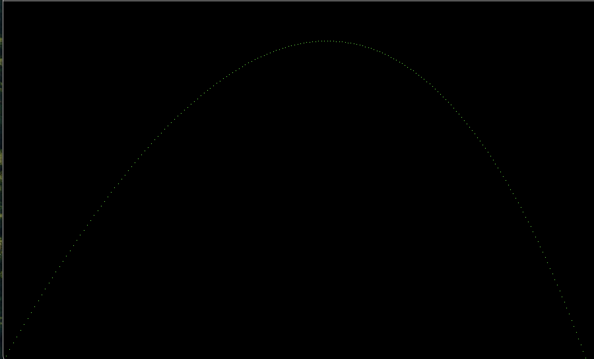

# Ray tracing challenge in Golang
The Ray Tracer Challenge A Test-Driven Guide to Your First 3D Renderer by Jamis Buck 
[Ray Tracer challenge](https://www.amazon.com/Ray-Tracer-Challenge-Test-Driven-Renderer/dp/1680502719)

# Practises I followed
1. Constructors for anythings will be of the form "<Name>_" for example "Canvas_()"
2. Writing tests before the actual function
3. 

# Changelog
- Completed first chapter
    - includes factory pattern for creation of point and vector
    - understanding of structs and interfaces and how to use them
    - yet to see how to perform operator overloading in golang: Go does not support traditional operator overloading as found in some other programming languages. In Go, operator overloading is not allowed, and the behavior of operators is fixed for built-in types. This design choice simplifies the language and reduces complexity.

    However, you can achieve similar functionality in Go by defining methods with custom names to implement specific operations. This approach allows you to create methods that mimic the behavior of operators.
    - includes basic functions like dot,cross,magnitude and scalar on points and vectors
    - figured out how to write tests in golang
    - code for environment,projectile and Tick added. 

- Completed Second chapter
    - inlcudes functionality like Adding and subtracting colors as both methods and independent function
    - inlcudes code to create,edit and save a canvas as a ppm file. use command `open <filename>.ppm` to open a ppm file in mac.
    - code to simulate a projectile and get its ppm file
    - yet to implement proper formating of ppm files, currently line length exceed a bit more than 70 characters in ppm file
    - yet to see how to write better tests, till now tests have been very simple
    - yet to add functions as methods to Tuples , this will make code a lot simpler in the future.
    - This is what a simulated projectile looks like
    

